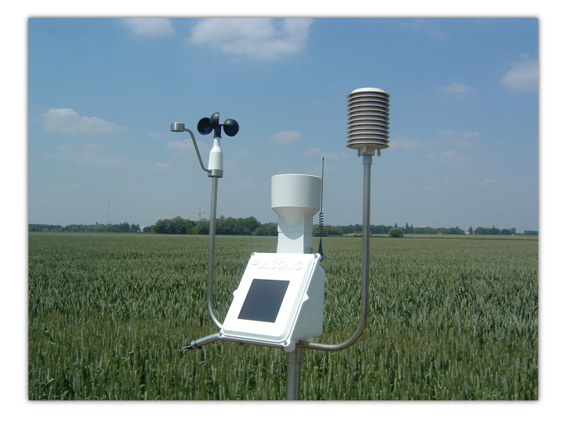
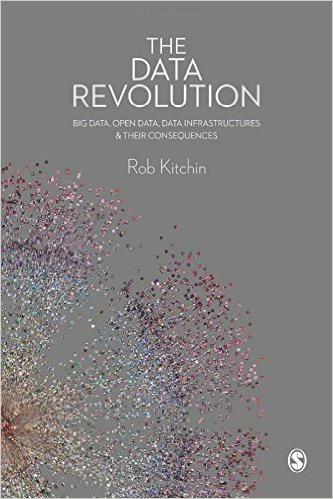
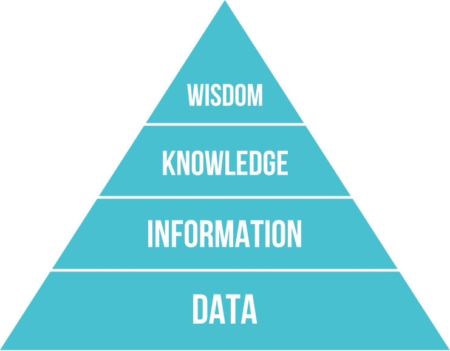

layout: true

`r paste0("
", params$event, " 

")` 

---

class: center, middle

Ces slides en ligne : `r paste0("http://moreymat.github.io/slides/", params$slug)`

Sources : `r paste0("https://github.com/moreymat/slides/", params$slug)`

 

.center[]

 

Les productions de Datactivist sont librement réutilisables selon les termes de la licence [Creative Commons 4.0 BY-SA](https://creativecommons.org/licenses/by-sa/4.0/legalcode.fr).

 

---
## Les données

.pull-left[

]
.pull-right[

]

???
Photo by Mika Baumeister on Unsplash
Photo by Taylor Vick on Unsplash
Photo by Markus Spiske on Unsplash
Photo by Clay Banks on Unsplash

---
## Les données au cœur des nouveaux géants

.pull-left[.red[**Netflix / Amazon Video**]

]
.pull-right[
- Sélection de contenus
  * données comportementales face à un contenu (play/pause, avance rapide, 2e passage...)
- Recommandation de contenus, marketing ciblé
  * données organiques d'utilisation de la plateforme (historique de visionnage, notes) mise en rapport avec les éléments de contenu]

???

Photo by Glenn Carstens-Peters on Unsplash

---

## Les données au cœur des nouveaux géants

.pull-left[.red[**Starbucks**]

]
.pull-right[
- Sélection d'implantation
  * données socio-démographiques : revenu moyen, âge, taux d'équipement... des usagers et habitants
  * données d'environnement : bureaux et commerces alentour, transport, sécurité
- Gestion de l'activité (approvisionnement, personnel)
  * données sur les événements
  * données météo]

???

https://medium.com/locale-ai/site-planning-using-location-data-ae7814973521

---
## “Datafication” : la mise en données du monde
> “L'immense gisement de données numériques découle de la capacité à paramétrer des aspects du monde et de la vie humaine qui n'avaient encore jamais été quantifiés. On peut qualifier ce processus de **« mise en données » (datafication)**. 

> […] “La mise en données désigne autre chose que la numérisation, laquelle consiste à traduire un contenu analogique - texte, film, photographie - en une séquence de 1 et de 0 lisible par un ordinateur. Elle se réfère à une action bien plus vaste, et aux implications encore insoupçonnées : **numériser non plus des documents, mais tous les aspects de la vie**.”

.footnote[[Kenneth Cukier, “Mise en données du monde, le déluge numérique”](https://www.monde-diplomatique.fr/2013/07/CUKIER/49318)]

---
## Vers une définition des données

.pull-left[]
.pull-right[
> *Data are commonly understood to be the raw material produced by **abstracting the world** into categories, measures and other representational forms – numbers, characters, symbols, images, sounds, electromagnetic waves, bits – that constitute the **building blocks** from which information and knowledge are created.*
]

---
class:middle
## Données, captées ou obtenues ?

> *Technically, then, what we understand as data are actually **capta** (derived from the Latin capere, meaning ‘to take’); those units of data that have been selected and harvested from the sum of all potential data.*

[Kitchin, 2014](https://books.google.fr/books?hl=fr&lr=&id=GfOICwAAQBAJ&oi=fnd&pg=PP1&dq=kitchin+data+revolution&ots=pcyfMTZh-V&sig=dQyPTL3AIN_4RdWvtBFw4VjdAa4#v=onepage&q=kitchin%20data%20revolution&f=false)

> « Décidément, on ne devrait jamais parler de “données”, mais toujours d’ “obtenues”. » 

Bruno Latour, 1993

---
## La pyramide DIKW

.pull-left[Ackoff (1989), Rowley (2007)

.center[]
*.tiny[The Knowledge Pyramid (Wikimedia Commons, by Longlivetheux, CC-BY-SA)]*
]
.pull-right[- W: jugement humain ; mobilisation de connaissances pour l'.red[**action**]

- K: mobilisation d'informations pour contrôler un système ou construire un .red[**modèle**]

- I: données utilisables, pertinentes, traitées, inférées ; données mobilisées pour la .red[**réponse à une question**]

- D: représentations symboliques des .red[**propriétés**] des objets, des événements et de leur environnement]

???

- données : mesures, observations, faits... nombres, mots, phrases...

---
## Les données : or, pétrole, ou autre chose?

.pull-left[]
.pull-right[Les données sont des .red[**actifs intangibles**]:

- scalables: copies à coût négligeable

- irrécupérables: valeur de revente faible (sauf concurrents)

- diffusables: capture facilitée par l'effet réseau

- synergisables: valeur augmentée par le croisement]

---
class: inverse, center, middle

# Merci !

Contact : [mathieu@datactivist.coop](mailto:mathieu@datactivist.coop)

