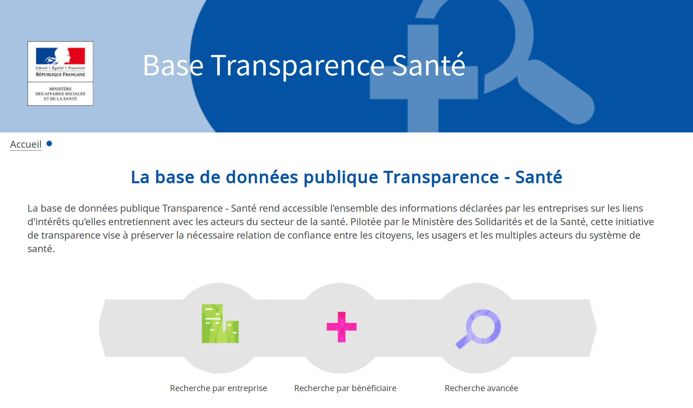
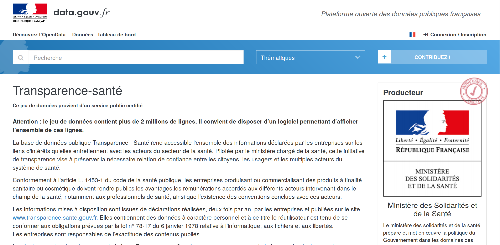
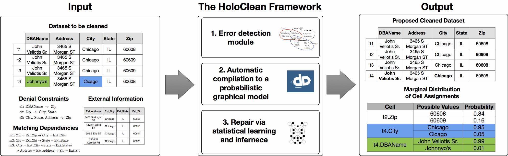

# Recherche par entreprise #

ex: "Sanofi Aventis France"

* 2013--2018:
  - timeout

* 2013:
  - 27.917 avantages,
  - 34.854 conventions,
  - 1.857 rémunérations

* Et quand on clique sur certains bénéficiaires...


---


# Recherche par bénéficiaire #

ex: "Morey"

* entrées similaires à Poligny:
  - "34 R VIEIL HOPITAL"
  - "34, RUE DU VIEIL HÔPITAL"
  - "PHCIE MIDOT 34 R DU VIEL HOPITAL"

* entrées similaires à Libourne:
  - ("112 RUE DE LA MARNE" | "HOPITAL ROBERT BOULIN")
  - ("Infirmier" | "Médecin")


# Bilan exploration par le site #

* La base présente des **problèmes de qualité**: variations des valeurs saisies, valeurs manquantes, erreurs...
  - ["Les ratés de la base de données publique Transparence Santé."](https://www.lemonde.fr/les-decodeurs/article/2017/10/12/les-rates-de-la-base-de-donnees-publique-transparence-sante_5199937_4355770.html)

* Le site n'offre pas une expérience utilisateur très riche: absence de vue synthétique ou analytique, documentation insuffisante et cryptique.
  - [Euros for Docs](https://www.eurosfordocs.fr/) inspiré de [Dollars for Docs](https://projects.propublica.org/docdollars/)


---




# Exploration du jeu de données #

Lien direct: <https://www.transparence.sante.gouv.fr/exports-etalab/exports-etalab.zip>

* Combien d'entreprises déclarantes?

* Combien d'avantages, conventions, rémunérations ?


# Outils Unix #

```sh
# nb entreprises
head -n 5 data/entreprise_2018_11_24_04_00.csv
wc -l data/entreprise_2018_11_24_04_00.csv
# nb avantages
head -n 5 data/declaration_avantage_2018_11_24_04_00.csv
wc -l data/declaration_avantage_2018_11_24_04_00.csv
# id. conventions et remunerations
```

* entreprises: 2.812
* avantages: 9.604.936
* conventions: 4.123.166
* rémunérations: 280.981


# Alternative: miller #

<https://github.com/johnkerl/miller>

> Miller is like awk, sed, cut, join, and sort for name-indexed data such as CSV, TSV, and tabular JSON.  
> Miller is multi-purpose: it’s useful for data cleaning, data reduction, statistical reporting, devops, system administration, log-file processing, format conversion, and database-query post-processing.  
> Miller complements data-analysis tools such as R, pandas, etc.: you can use Miller to clean and prepare your data. While you can do basic statistics entirely in Miller, its streaming-data feature and single-pass algorithms enable you to reduce very large data sets.


# Installation de miller #


```sh
apt-get install miller
```

[miller doc](https://johnkerl.org/miller/doc/index.html)


# Exploration avec miller #
```sh
# nb entreprises
mlr --csv cat -n then tail -n 1 data/entreprise_2018_11_24_04_00.csv
# nb avantages
mlr --csv --ifs ';' cat -n then tail -n 1 data/declaration_avantage_2018_11_24_04_00.csv
# id. conventions et remunerations
```

* entreprises: 2.812
* avantages: 9.604.485
* conventions: 4.120.314
* rémunérations: 280.940


# `wc -l != mlr cat -n` ? #

* `wc -l` compte les caractères `\n` (attention si la dernière ligne d'un fichier ne se termine pas par ce caractère!) ;
`cat -n` compte les lignes, séparées par `\n`.

* `mlr cat -n` compte les entrées, champ par champ, en tenant compte des guillements doubles utilisés pour protéger certaines valeurs textuelles.

Donc?


# `wc -l != mlr cat -n` ! #
* Certains champs de texte libre contiennent du texte incluant des `\n` (multiline strings).

```sh
grep -A1 --color=always ';"[^";]*$' data/declaration_avantage_2018_11_24_04_00.csv|less
```


# Exploration avec pandas #

```python
import pandas as pd
df_a = pd.read_csv("data/declaration_avantage_2018_11_24_04_00.csv", sep=';')
df_a.shape
# (9604485, 36)
```

Pourquoi ne pas utiliser directement pandas?


# miller vs pandas: CPU #

```sh
time mlr --csv --ifs ';' cat -n then tail -n 1 data/declaration_avantage_2018_11_24_04_00.csv
# 38,53s user 1,10s system 99% cpu 39,636 total
```

```python
from time import time
t0 = time() ; df_a = pd.read_csv("data/declaration_avantage_2018_11_24_04_00.csv", sep=';') ; t1 = time() ; print(t1 - t0)
# 53.411545515060425
```


# miller vs pandas: RAM #

```sh
/usr/bin/time -v mlr --csv --ifs ';' cat -n then tail -n 1 data/declaration_avantage_2018_11_24_04_00.csv
# Maximum resident set size (kbytes): 2754560
# soit environ 2.6 GB
```

```python
df_a.info(memory_usage='deep')
# dtypes: int64(1), object(35)
# memory usage: 18.3 GB
```


# pandas: moins de RAM #

Pour chaque colonne, un autre dtype est-il possible?
```python
# nb valeurs non nulles, nb uniques,
# valeur la plus fréquente et sa fréquence
df_a.describe(include='all').transpose()[['count', 'unique', 'top', 'freq']]
```
15 colonnes contiennent beaucoup d'occurrences d'un nombre restreint de valeurs distinctes.
Sémantiquement, elles semblent correspondre à des **variables catégorielles**.


# pandas: dtypes #

```python
cols_desc = df_a.describe(include='all').transpose()[['count', 'unique', 'top', 'freq']]
```

```python
cat_cols = cols_desc[cols_desc['unique'] < 100].index.values.tolist()
cat_dtypes = {x: 'category' for x in cat_cols}
df_a = df_a.astype(cat_dtypes, copy=False)
# verif memoire
df_a.info(memory_usage='deep')
# dtypes: category(15), int64(1), object(20)
# memory usage: 9.9 GB
```


# pandas: dump dtypes #

`read_csv` a un argument optionnel qui permet de spécifier le dtype d'une ou plusieurs colonnes.
L'inférence de type est désactivée pour ces colonnes.

```python
# on exporte dans un json le dtype des colonnes pour
# éviter (à soi ou aux autres) de refaire ce travail
# préliminaire
import json
col_dtypes = df_a.dtypes.astype(str).to_dict()
with open('data/avantage_dtypes.json', mode='w') as f:
    json.dump(col_dtypes, f)
```


# pandas: `read_csv(dtype=...)` #
Nouvelle session:
```python
import pandas as pd
import json
# lecture des dtypes
with open('data/avantage_dtypes.json', mode='r') as f:
    col_dtypes = json.load(f)
df_a = pd.read_csv("data/declaration_avantage_2018_11_24_04_00.csv", sep=';', dtype=col_dtypes)
```


# pandas: et pour les autres colonnes? #

```python
df_a.describe(include='object').transpose()[['count', 'unique', 'top', 'freq']]
```
* variables catégorielles intéressantes (RAM) si unique << count
  - toutes sauf `ligne_identifiant`, `avant_convention_lie`, `benef_denomination_sociale`?

* `entreprise_identifiant` est sûrement une clé étrangère (table des entreprises) ; `denomination_sociale` doit correspondre également

* `benef_adresse{1..4}` sont à interpréter ensemble


# pandas: catégories #

```python
df_a = df_a.astype({'entreprise_identifiant': 'category', 'denomination_sociale': 'category'}, copy=False)
# [...] memory usage: 8.8 GB
# etc.
```


# pandas: dates #

`avant_date_signature` doit être une date, utilisons le dtype adéquat:
```python
df_a['avant_date_signature'] = pd.to_datetime(df_a['avant_date_signature'], format='%d/%m/%Y')
# OutOfBoundsDatetime: Out of bounds nanosecond timestamp: 17-10-17 00:00:00
# solution: errors='coerce' ou errors='ignore'
```

```sh
mlr --csv --ifs ';' grep "17/10/0017" then cat -n data/declaration_avantage_2018_11_24_04_00.csv
```


# Problème de qualité 1: valeurs incorrectes #

* 30 entrées contiennent cette date erronée, toutes pour des repas offerts par les laboratoires Servier à des cardiologues de différents hôpitaux (le 17/10/2017?).

* Explications possibles (+/- optimistes): erreurs de saisie indépendantes, erreurs de saisie liées (événement? saisie groupée?) ; les dates déclarées correctes en apparence sont-elles fiables?

* Autre exemple: `benef_ville`="MARSEILLLE"


# Problème de qualité 2: valeurs de remplissage #

```python
df_a["benef_identifiant_valeur"].value_counts()
```

* Les valeurs les plus fréquentes ressemblent à de faux identifiants ou des valeurs de remplissage: [SO], SO (sans objet?), 0, [AUTRE], 10000000000, 00000000000, `BENEF_IDENTIFIANT_VALEUR`, [BR], NON RENSEIGNE, [0], 9999, `.`, INFORMATION NON DISPONIBLE, 10000000001, MANIPULATEUR EN RADIOLOGIE.

* Vérification manuelle: "508331303" est un SIREN valide (ok).


# Bilan du jeu de données #

* Volumétrie importante: > 13 millions d'entrées

* Forte hétérogénéité et faible qualité dues à:
  - mode de déclaration (peu de contrôles à la soumission),
  - nombre d'entreprises déclarantes (> 2.800).


# OpenRefine #
<http://openrefine.org>

Outil de correction semi-automatique itératif:

* travail par facettes/filtres

* heuristiques de clustering: collision de clés, plus proches voisins (plusieurs variantes pour chacune)

* on sélectionne les fusions à réaliser

* plus éventuellement données externes (wikidata)

=> Produire rapidement une version corrigée d'un jeu de données (corrections simples).


# HoloClean #


=> Produire une version plus finement corrigée d'un jeu de données (corrections complexes grâce à la machinerie ML).


# dirty-cat #
<https://dirty-cat.github.io>

* Généralisation de l'encodage one-hot en encodage de similarité de chaînes, pour les variables catégorielles

* Permet d'exposer et d'intégrer la similarité entre catégories aux modèles de prédiction

=> Utiliser des jeux de données sales, sans nettoyage préalable, dans des systèmes de prédiction


# Conclusion #
* Les problèmes de qualité sont un frein majeur à la publication et à la réutilisation de données (ouvertes).

* Ils sont issus du **travail invisibilisé de production des données**, dont on retrouve quelques traces dans la documentation et dans les données elles-mêmes.

* L'exploitation de jeux de données "sales" nécessite l'utilisation d'outils adéquats:
  - outil de correction heuristique
  - outil de correction semi-automatique avec ML
  - composant qui permet d'exposer et d'intégrer l'incertitude de qualité dans un système de prédiction.
