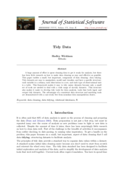

---
title: Explorer des données non-structurées
author: Mathieu Morey - mathieu@datactivist.coop
date: 11 janvier 2019
width: 1400
height: 900
...

# Data: the good, the bad... #

{ width=50% class="plain" }

{ width=50% class="plain" }

# Tidy data #

> "Happy families are all alike; every unhappy family is unhappy in its own way." –– Leo Tolstoy

> "Tidy datasets are all alike, but every messy dataset is messy in its own way." –– Hadley Wickham

{ width=50% class="plain" }

# Tidy data: références #

{ width=15% class="plain" } $\qquad$ { width=15% class="plain" }

* Wickham, Hadley, and Garrett Grolemund. R for data science: import, tidy, transform, visualize, and model data. " O'Reilly Media, Inc.", 2016.
  - disponible gratuitement en ligne: <https://r4ds.had.co.nz/>
  - chapitre "Tidy Data": <https://r4ds.had.co.nz/tidy-data.html>

* Hadley Wickham. Tidy data. The Journal of Statistical Software, vol. 59, 2014.
  - <http://vita.had.co.nz/papers/tidy-data.html>

# Data: ... and the ugly

{ width=70% class="plain" }

# Data: ... and the ugly (bis)

{ width=70% class="plain" }

# Et les données non-structurées ? #

* Fichiers textes et documents (.doc, .pdf, .html, .ppt)
* Courriels
* Données issues des réseaux sociaux
* Images
* Fichiers sons
* Vidéos
* Logs de serveurs, sites, applications

Comment extraire les nombreuses informations contenues dans ces données non-structurées?

# Difficultés #

{ width=25% class="plain" }

<!-- In the 60s, Marvin Minsky assigned a couple of undergrads to spend the summer programming a computer to use a camera to identify objects in a scene. He figured they'd have the problem solved by the end of the summer. Half a century later, we're still working on it. -->

# Branches de l'IA #

* Vision par ordinateur (Computer Vision)
  - détection d'objet (Object Detection)
  - reconnaissance optique de caractères (Optical Character Recognition)

* Traitement automatique du langage naturel (Natural Language Processing)

Progrès de la recherche dans ces branches de l'IA => amélioration des performances des systèmes

# Panama papers #

* 11.4 M fichiers, 2.6 To données
* "Soit plusieurs décennies de lecture jour et nuit si l’on veut aller d’un bout à l’autre de la base de données – sans compter la complexité de certains dossiers."

{ width=40% class="plain" }

# Stack technique ICIJ #

* extraction du texte par OCR avec Tesseract,
* recherche de termes avec Talend,
* indexation des résultats avec Apache Solr,
* tokenization, filtrage, stemming, clustering de termes avec RapidMiner,
* classification automatique de documents avec RapidMiner.

<https://www.icij.org/blog/2018/08/how-machine-learning-is-revolutionizing-journalism/>

# Limites #

* Données:
  - Fautes d'orthographe
  - Variations de la graphie
* Masse de données à analyser:
  - Filtrer les documents peu intéressants,
  - Stratégies de classification plus élaborée,
* Systèmes:
  - Erreurs d'OCR
  - Erreurs de NER
  - NB: erreurs en cascade => effet multiplicatif

# Data pipeline #

{ width=50% class="plain" }

# Aleph #

<https://datajournalismawards.org/2018/05/09/how-to-handle-massive-datasets-and-other-lessons-from-occrp-data-and-aleph/>

{ width=50% class="plain" }

# Architecture d'Aleph #

{ width=50% class="plain" }

# Named Entity Recognition #

Schéma d'annotation des dumps Wikipedia:

* PER:	Named person or family.
* LOC:	Name of politically or geographically defined location (cities, provinces, countries, international regions, bodies of water, mountains).
* ORG:	Named corporate, governmental, or other organizational entity.
* MISC:	Miscellaneous entities, e.g. events, nationalities, products or works of art.

D'autres schémas d'annotation plus détaillés existent.

# Pipeline spaCy #
{ width=50% class="plain" }

# Entraînement spaCy #
{ width=50% class="plain" }

# Architecture spaCy #

{ width=50% class="plain" }

# Annotation de données #

{ width=50% class="plain" }

diaporama: <https://datactivist.coop/prodigy_textcat/>

# Maîtrise et responsabilité #

* Les jeux de données que nous utilisons, constituons ou annotons constituent-ils un échantillon représentatif des données que nous voulons analyser ?
* Les sources de données sont-elles, elles-mêmes, biaisées?
* Pouvons-nous décrire de façon fiable le fonctionnement d'un modèle prédictif que nous utilisons?
Savons-nous expliciter ses critères de décision?
* Pouvons-nous expliciter les limites de fiabilité d'un modèle prédictif?

# Can algorithms have gender or racial bias ? #

<https://twitter.com/WIRED/status/1088128075508768768>

# AI isn't dangerous #

... but human bias is

<https://www.weforum.org/agenda/2019/01/ai-isn-t-dangerous-but-human-bias-is/>

# Substantive vs procedural fairness #

<https://theconversation.com/biased-algorithms-heres-a-more-radical-approach-to-creating-fairness-109748>

# Réponse(s) de la communauté ML #

<https://twitter.com/timnitGebru/status/1088313350407110656>

<https://arxiv.org/abs/1901.04966v1>

# Documenter les biais des données #

Datasheets for Datasets
<https://arxiv.org/abs/1803.09010>

# Documenter les biais et les limites des modèles #

Model Cards for Model Reporting
<https://arxiv.org/abs/1810.03993>

# Interprétabilité #

Débat Neural Information Processing Systems 2017:
<http://www.youtube.com/watch?v=2hW05ZfsUUo>

Analysis Methods in Neural Language Processing: A Survey
<https://arxiv.org/abs/1812.08951>

# Interprétabilité (concrète) #

<https://www.tensorflow.org/guide/summaries_and_tensorboard>

# Résumé

* Tidy data

* Des techniques d'IA permettent d'extraire des données structurées à partir de données non-structurées
  - extraction d'entités nommées par OCR + NER
* avec
  - application de modèles standard
  - annotation active
  - apprentissage de modèles ajustés aux corpus visés.
